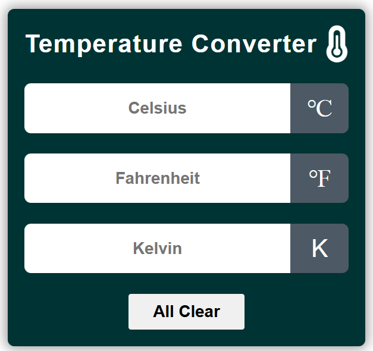

# Temperature-Converter

This is simple but most reliable Temperature Converter application to use for interchange temperature parameter in Degree Celsius, Kelvin & Fahrenheit in realtime. This website made using HTML, CSSk & JavaScript.

## Features
- Convert Real time Temperature Measurment Unit.
- clear button to reset your data.

## Usage:
1. Clone this repository.
2. Open `index.html` in your web browser.
3. Start managing your address book!

## License
This project is licensed under the MIT License - see the [LICENSE.md](https://github.com/AnkushRajMaheYam/Temperature-Converter/blob/main/LICENSE.md) file for details.

## Credits
This website was created by Ankush Raj Mahe Yam (ARMY). All rights reserved.

## About Me  

Hi, I’m **Ankush Raj Mahe Yam (ARMY)**, an aspiring software developer. I’m passionate about coding and enjoy sharing my learning journey to help others grow.  

🌟 Connect with me:  
- **Google Search:** [Ankush Raj Mahe Yam](https://www.google.com/search?q=ankush+raj+mahe+yam)  
- **LinkedIn:** [Ankush Raj Mahe Yam](https://linkedin.com/in/ankushrajmaheyam)  
- **GitHub:** [Ankush Raj Mahe Yam](https://github.com/AnkushRajMaheYam)  
- **Instagram:** [@AnkushRajaMaheYam](https://instagram.com/AnkushRajaMaheYam)  
- **Facebook:** [Ankush Raj Mahe Yam](https://facebook.com/AnkushRajMaheYam)  

---
